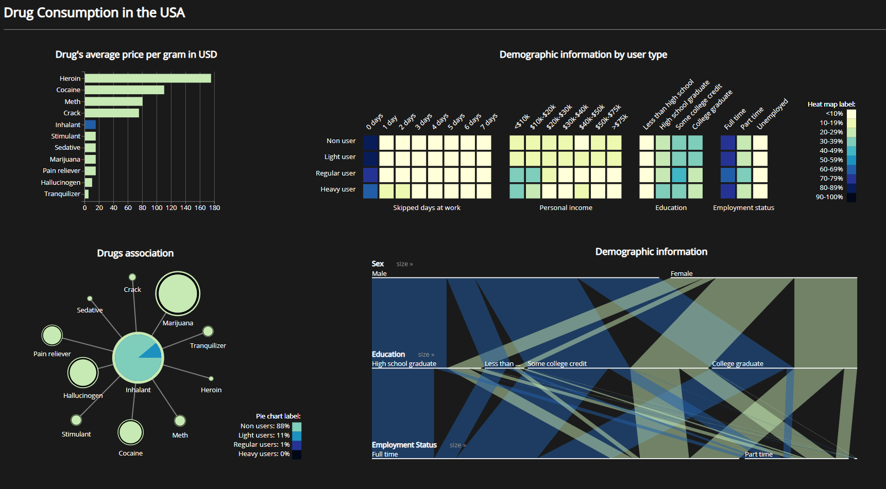
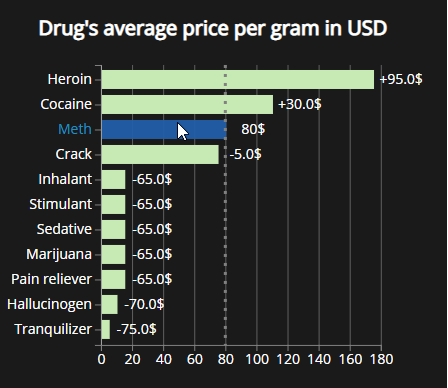
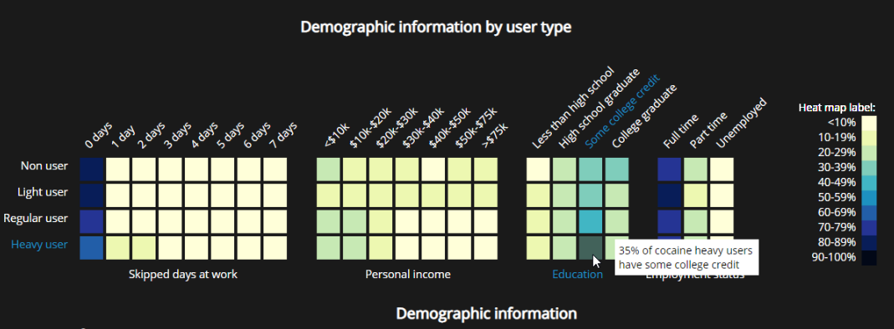
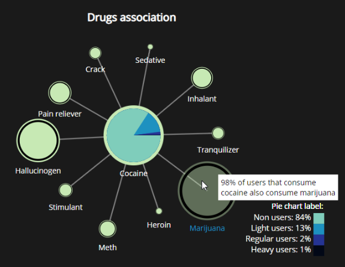
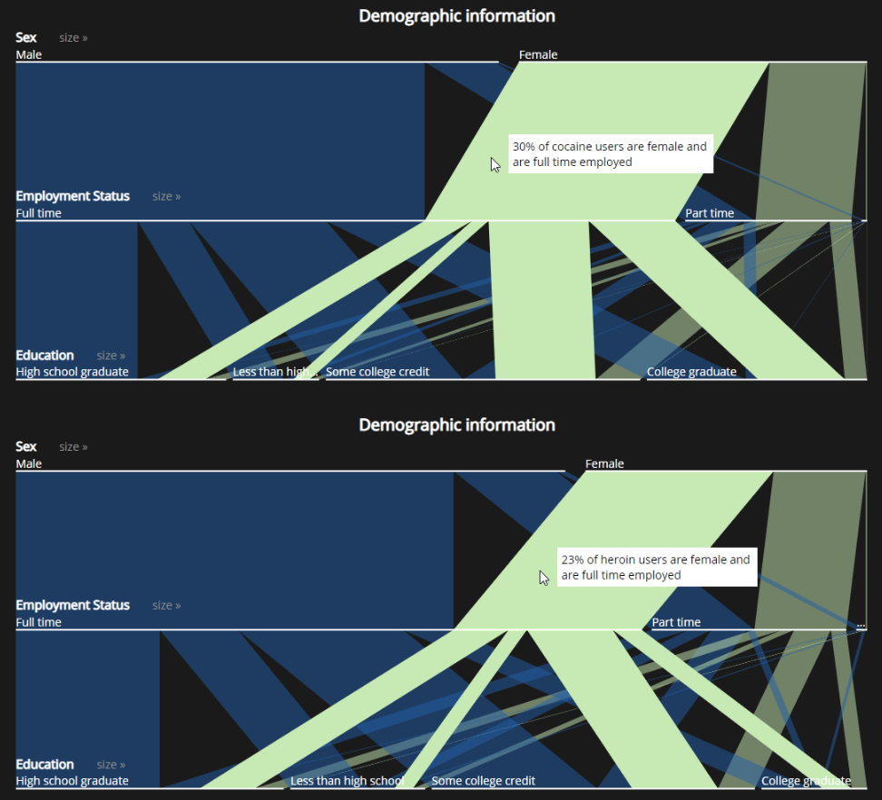

# Drug Consumption in the USA: A Data Analysis and Visualization

This project was developed in the context of the Information Visualization course project, made by Daniela Duarte, João Alves and João Esteves, from Instituto Superior Técnico (Lisbon).
The goal was to make use of data visualization techniques to analyse and explore data in a interactive way, and obtain insights. 
Specifically, the drug consumption habits of American citizens was studied, and it was 
intented to complete the following tasks:

1. Find drug prices and compare them;
2. Get demographic information distribution for each user type;
3. Find the comsumption association between drugs;
4. Get the distribution of users that verify certain demographic characteristics.

## Data
The dataset used in this study concerns [drug consumption habits in the USA](https://data.world/balexturner/drug-use-employment-work-absence-income-race-education), and it was also used the information of [drug prices](https://www.dnalegal.com/drugs-menu). A variety of information can be found in the dataset of drug consumption habits. We enumerate a few:
* Sex;
* Ethnicity;
* Education;
* Personal income;
* Employment status;
* Whether the user has consume a specific drug and the number of times in month and year;
* Number of times the user has missed work.

The dataset was processed in the following manner:
1. Removal of columns that were irrelevant for our visualization.
2. Removal of rows containing erroneous data.
3. Derive a new column attribute called type of user.

## Visualization Techniques
Our solution is composed of four idioms: 

* A [bar
chart](https://blog.risingstack.com/d3-jstutorial-bar-charts-with-javascript/) with prices for several drugs;
* An heatmap relating types
of drug users with demographic information;
* A [node pie](https://bl.ocks.org/kgeorgiou/68f864364f277720252d0329408433ae) associating
different drugs and showing the user types distribution;
* [Parallel sets](https://www.jasondavies.com/parallel-sets/) crossing demographic information.

We chose a master-slave approach to our solution, the master
being the bar chart and all others being the slaves. This means
that by clicking on a bar, the correspondent drug will propagate
to all other idioms, showing only information about that
drug.

The javascript library D3.js was used to develop all visualization techniques, and an overview can be found in the figure below.

## Demonstrating the potential
Getting back to the tasks initially proposed, the following examples show how to answer some questions.

1. Task 1 - Is meth more expensive than marijuana?

This answer can be given using only one idiom, the bar chart.
We hover the mouse on the meth bar in bar chart, Figure 11,
and we can see ahead of the bar the price of meth, 80 USD.
And still while hovering the meth bar, in the marijuana bar we
can see the price difference, and we can see that it costs less
65 USD than meth. This can also be answered by hovering
the marijuana bar.

2. Task 2 - What is the income and education of a
cocaine heavy-user?

To answer this question, see figure 12, we need to analyze the
heatmap, but first we select the drug cocaine on the bar chart.
Then we analyze the heatmap on the heavy user row for the
demographic attributes Education and Personal Income. If we
need exact information that is not given by the colors (hence
it is discretized),

3. Task 3 - Which other drug cocaine consumers
consume the most?

Like in the previous question we first need to select the drug
cocaine on the bar chart so that we can see information about this drug. Next we look at the pie chart, Figure 13, and the
bigger the nodes connected to the central node the biggest
the correlation with the selected drug. We can see that the
biggest node seems to be marijuana, but if we need additional
information we can hover the mouse over marijuana node,
and we can see that 98% of cocaine users also use this node
drug. In this idiom we can see that for all drugs have a strong correlation
with marijuana drug, this may be an argument in favor
of the hypothesis that marijuana is an gateway drug (a drug
that leads the user on to more addictive or dangerous drugs).

4. Task 4 - Between heroin and cocaine, which one
has more full time employed female consumers?

To answer this question we need to visualize information
about two drugs. So, lets start by selecting cocaine on the bar chart, next we look at the parallel sets idiom, Figure 14. We
organize the sets of this idiom according with the information
we need, we want female and full time employed, so we start
with the Sex attribute on top followed by the Employment
Status. Since we do not need to filter the information through
the Education set, we simply hover the block connecting Female
in Sex with Full time in employment status, this will
give us the exact percentage of female full time employed for
the drug cocaine, 30%. Next we do the same for the drug
heroin, 23%, and we can see that the answer to the question
is cocaine.

